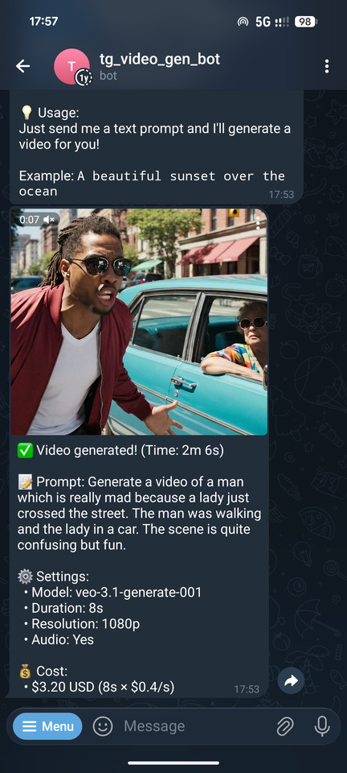

# Telegram Video Generation Bot

A **Telegram bot** that generates videos using **Google Veo API**.

<p align="center">
  
</p>

## Prerequisites

- Python 3.13
- Google Cloud Project with Veo API enabled
- Telegram Bot Token (get from [@BotFather](https://t.me/BotFather))
- Google Cloud service account credentials JSON file

## Setup

1. **Install dependencies:**
   ```bash
   pip install -r requirements.txt
   ```

2. **Create a `.env` file** in the project root with the following variables:
   ```bash
   TELEGRAM_BOT_TOKEN=your_telegram_bot_token_here
   GOOGLE_CLOUD_PROJECT_ID=your_gcp_project_id
   GOOGLE_APPLICATION_CREDENTIALS=/path/to/your/service-account-key.json
   GOOGLE_CLOUD_LOCATION=europe-west8  # Optional, defaults to europe-west8
   ```

3. **Get your Telegram Bot Token:**
   - Message [@BotFather](https://t.me/BotFather) on Telegram
   - Use `/newbot` command to create a new bot
   - Copy the token provided

4. **Set up Google Cloud credentials:**
   - Go to [Google Cloud Console](https://console.cloud.google.com/) and create a new project (or use an existing one)
   - Find your **Project ID** (shown in the project dropdown at the top, or in Project Settings) and set it as `GOOGLE_CLOUD_PROJECT_ID` in your `.env` file
   - Enable the **Vertex AI API** in [APIs & Services > Enable APIs and services]
   - Create a service account in [IAM & Admin > Service Accounts]
   - Grant the service account these roles:
     - **Vertex AI User**
     - **Storage Object Viewer**
   - Create a JSON key for the service account (Keys > Add Key > Create new key > JSON)
   - Download the JSON file and set the absolute path in your `.env` file as `GOOGLE_APPLICATION_CREDENTIALS`
   - Set `GOOGLE_CLOUD_LOCATION` in your `.env` file (e.g., `europe-west8`, `europe-west6`).
   - **Note:** Make sure billing is enabled for your project (required for Veo API)

## Running the Bot

Run the bot with:

```bash
python -m bot.main
```

The bot will start polling for messages. You should see log messages indicating the bot has started.

## Usage

Once running, interact with your bot on Telegram:

- Send a regular message → treated as a video generation prompt
- `/start` - Welcome message
- `/help` - Usage instructions
- `/settings` - View current settings
- `/setmodel <model>` - Set Veo model (e.g., `veo-3.1-generate-001`)
- `/reset` - Reset to defaults
- `/stats` - View usage stats
